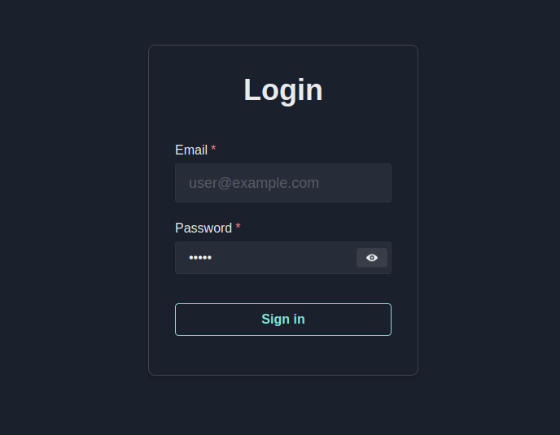

# Login Form with Chakra UI

Login Form example using Chakra UI for React.
> <a href="https://chakra-ui.com/guides/first-steps"> Chakra UI Documentation. </a>

  
🚀 To run, you need to:
```
  > Clone this repository
  
  > yarn install
  
  > yarn start
```
> ❓ To install yarn, run this on terminal: ```npm install --global yarn```

## Screenshot


